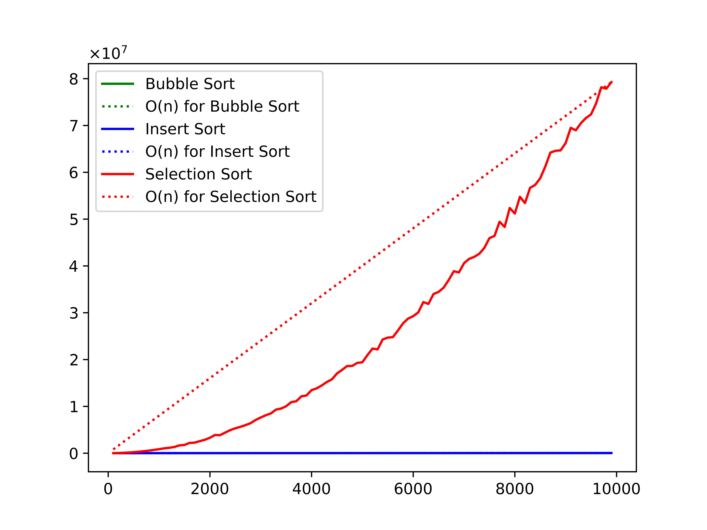
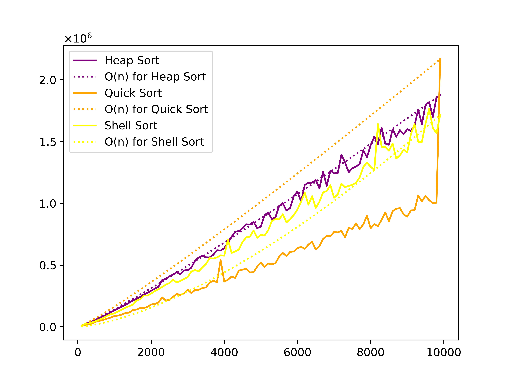
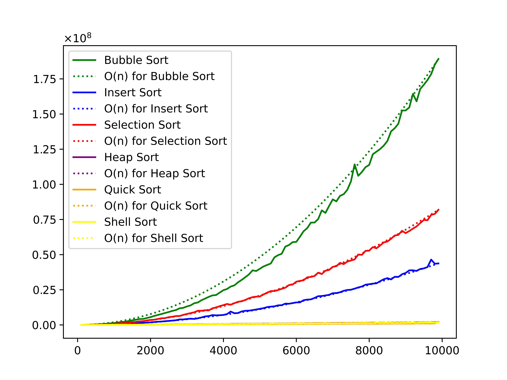

# Projekt sortowanie

## Cel Projektu
Celem projektu jest implementacja, testowanie i porównanie różnych metod sortowania tablic liczb całkowitych

## Metody Sortowania
Metody sortowania zostały podzielone na dwie grupy:

### I Grupa Metod
1. Sortowanie przez wstawianie
2. Sortowanie przez selekcję
3. Sortowanie bąbelkowe

### II Grupa Metod
1. Quicksort
2. Sortowanie Shella
3. Sortowanie przez kopcowanie

## Poniżej przedstawiam diagramy dla każdej z nich

### Sortowanie przez wstawianie
  
### Sortowanie przez selekcję
  
### Sortowanie bąbelkowe
  
### Quicksort
  
### Sortowanie Shella
  
### Sortowanie przez kopcowanie
  

## Testy Wydajności
Dla każdej z metod przeprowadzone zostaną trzy rodzaje testów na tablicach o rosnącej liczbie elementów:

- **Test1:** Dla danych wygenerowanych losowo
- **Test2:** Dla danych posortowanych w kolejności odwrotnej (malejąco)
- **Test3:** Dla danych posortowanych właściwie (rosnąco)

### Pomiar Czasu
Do pomiaru czasu użyta została funkcja systemowa `clock_gettime`, wywoływana przed i po sortowaniu. Różnica uzyskanych czasów wskaże czas sortowania.

## Wykresy Zależności Czasu Sortowania
Dla analizy wyników każdego testu przygotowałem wykresy, gdzie linia kreskowana pokazuje złożoność obliczeniową, a ciągła realny czas:

### Zbiorczy wykres dla metod z I grupy.

### Zbiorczy wykres dla metod z II grupy.

### Zbiorczy porównujący wszystkie metody z I i II grupy.

W sumie uzyskamy 9 wykresów – po 3 dla każdego zestawu danych.
